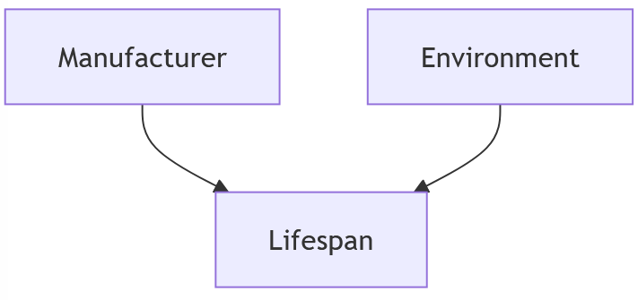

# KDDM 2 Homework
**Author: Alex Ghiriti - aghiriti@student.tugraz.at - 11904833**

### Task 1: Causality 
_TODO: Please provide an own example for a Simpson’s paradox (i.e., not an example from the slides, Wikipedia,etc.). Add the code and the result to the submitted zip file._

**(a)** My generated data can be found in [results/1a_simpsons_paradox.csv](results/1a_simpsons_paradox.csv). Code for generating tis in the task1 function under [src/kddm2.py](src/kddm2.py). 

**(b)** Graph and Table of the Results:

| maker   |   Overall Lifespan |   Bad Environment |   Good Environment |
|:--------|-------------------:|------------------:|-------------------:|
| ARUBA   |            1552.68 |           709.568 |            1810.49 |
| CISCO   |            1351.05 |          1098.83  |            2232.76 |

**(c)** This is a personal example of encountering Simpson's Paradox. The data includes:

1. Switch Manufacturer: Cisco/Aruba
2. Environment: 1 (Server Room) / 0 (Industrial Grounds)
3. RMA Cycle / Life Expectancy: in Days

The goal was to determine which manufacturer had a better life expectancy for a specific customer to reduce RMAs. Initially, the aggregated data suggested that Aruba switches had a longer life expectancy. However, after discussing with a colleague, I learned that many RMAs were related to the deployment environment—specifically, industrial environments with harsh, oily air conditions.

Further analysis revealed that Cisco switches were more frequently deployed in harsh environments, while Aruba switches were predominantly in good environments. After introducing environment as a variable, it became clear that Cisco switches outperformed Aruba switches in both good and bad environments.

Interpretation: Although the initial aggregated data suggested otherwise, Cisco switches are the better choice, as they perform better under all conditions. This case demonstrates the importance of accounting for confounding variables, like the environment, and using causal analysis to avoid misleading conclusions. Considering both the context and the data structure ensures more accurate decision-making, especially in complex systems like network infrastructure.

### Task 2

### Task 3

### Task 4: Math
(a) The task describes **clustering** with a loss function minimizing the distance between data points and their cluster centroids.

(b) For each data point $x_j$, compute $d(x_j, r_{l_j})$ if the value exceeds a predefined threshold, classify $x_j$ as an outlier.

(c) For each $x_\tau$, calculate the sum of connections to points with the same label:

$$\sum_{j \in \{i \mid l_i = l_\tau\}} A_{\tau j}$$ 

and the sum of connections to points with different labels:

$$\sum_{k \in \{i \mid l_i \neq l_\tau\}} A_{\tau k}.$$

Classify \($x_\tau$\) as an outlier if:

$$\sum_{j \in \{i \mid l_i = l_\tau\}} A_{\tau j} < \sum_{k \in \{i \mid l_i \neq l_\tau\}} A_{\tau k}.$$

`Disclaimer: This task was solved with AI assistance.`

